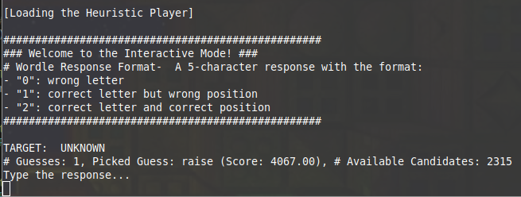
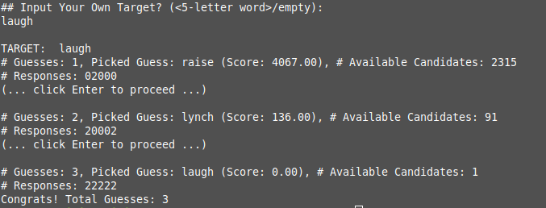

# Wordle Solvers in Python

- To guess an unknown 5-letter English word in fewest attempts
- Inspired by the Wordle game: https://www.powerlanguage.co.uk/wordle/

# Quick Start

### Playing a 5-letter Wordle game

In command line, run `$ python main.py interactive`

The program will guess a first word and let you type the response with the specified format. 

Based on your response, the program will pick a new guess word and the process repeats.

Your can also specify a target word by running

``$ python main.py interactive --with_target``

The program will simulate the guessing process with an automatically generated response to each of its guess.  

### Options

``$ python main.py <mode> --solver <solver> --first_guess <first-guess>``

The ``<solver>``  is either ``heuristic``, ``small-mig``, or ``large-mig``.  (*mig* stands for *Maximum Information Gain*). The default is ``heuristic``.

The ``<first-guess>`` specifies a fixed word for the solver to use in the first guess. The default is ``raise``. 

The ``<mode>`` is either ``interactive`` or ``analysis``:

- ``interactive``: (example as above) guess an unknown target with the manual response from the user, or use ``--with_target`` to specify a simulation process.

- ``analysis``: for analyzing the worst and average number of guesses of the solver. 

  Run ``$ python main.py analysis --first_guess <first-guess>``  

  and the solver will simulate the guessing process for all potential target words using the `first-guess` as the first word to guess. 

  Run ``$ python main.py analysis --topK <topK>`` to run the above analysis for the top-K first-guess words (with the highest internal solver score). 

  

  Statistics is saved in the ``/output`` folder.

### iPython Notebook is available

Check ``demo.ipynb`` for more usages.

# Wordle Solvers Basic Info

### The Heuristic solver 

``HeuristicWordlePlayer``

- Picks the guess based on **character frequencies**
- A word scores higher if it is composed of common characters rather than rare characters
- The worse and average number of guesses is **6** and **~3.82**, with the first guess as **"raise"**
- Computes on-the-fly. 

### The Maximum Information Gain Solver 

``MaxInformationGainWordlePlayer``

- Picks the guess based on **maximizing information gain**

- A word scores higher if it generates the maximum entropy among all potential targets

- The worse and average number of guesses is **5** and **~3.65**, with the first guess as **"react"**

- Computes slower and is optimized by pre-computation

- Providing a larger word list as the guess list improves the average number of guesses to **~3.60** with the start word as **"reast", "trace"** etc

  
