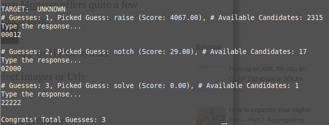

# Wordle Solvers in Python

- To guess an unknown 5-letter English word in fewest attempts

- Inspired by the Wordle game: https://www.powerlanguage.co.uk/wordle/

- Play it online! https://kiking0501.github.io/Wordle-Solver

  

      
  

  

    
  

# Quick Start (Command Line)

### Playing a 5-letter Wordle game

In command line, run `$ python main.py interactive`

The program will guess a first word and let you type the response with the specified format.

Based on your response, the program will pick a new guess word and the process repeats.

Your can also specify a target word by running

``$ python main.py interactive --with_target``

The program will simulate the guessing process with an automatically generated response to each of its guess.

# Quick Start (iPython Notebook)

See [``demo.ipynb``](/demo.ipynb).

# Wordle Solvers Basic Info

### The Heuristic solver

[``HeuristicWordlePlayer``](/blob/master/HeuristicWordlePlayer.py)

- Picks the guess based on **character frequencies**
- A word scores higher if it is composed of common characters rather than rare characters
- The worse and average number of guesses is **6** and **~3.82**, with the first guess as **"raise"**
- Computes on-the-fly.

### The Maximum Information Gain Solver

[``MaxInformationGainWordlePlayer``](/blob/master/MaxInformationGainWordlePlayer.py)

- Picks the guess based on **maximizing information gain**
- A word scores higher if it generates the maximum Shannon entropy from its response distribution (the count of all possible response outcomes with respect to the available target words).
- The worse and average number of guesses is **5** and **~3.65**, with the first guess as **"react"**
- Computes slower and is optimized by pre-computation
- Providing a larger word list as the guess list improves the average number of guesses to **~3.60** with the start word as **"reast", "trace"** etc

# More Command Line Options

``$ python main.py --solver <solver> --first_guess <first-guess> <mode> <mode arguments>``

The ``<solver>``  is either ``heuristic``, ``small-mig``, or ``large-mig``.  (*mig* stands for *Maximum Information Gain*). The default is ``heuristic``.

The ``<first-guess>`` specifies a fixed word for the solver to use in the first guess. The default is ``raise``.

The ``<mode>`` is either ``interactive`` or ``analysis`` and the mode arguments are as follows:

- ``interactive``: (examples as above) guess an unknown target with the manual response from the user, or add ``--with_target`` to specify a simulation process.

- ``analysis``: for analyzing the worst and average number of guesses of the solver.

  Run ``$ python main.py analysis`` and the solver will simulate the guessing process for all potential target words using the fixed first guess word (see above to change the first guess word).

  Run ``$ python main.py analysis --topK <topK>`` to run the above analysis for the automatically selected top-K first-guess words (that have the highest internal solver score).

  

  Statistics is saved in the ``/output`` folder.